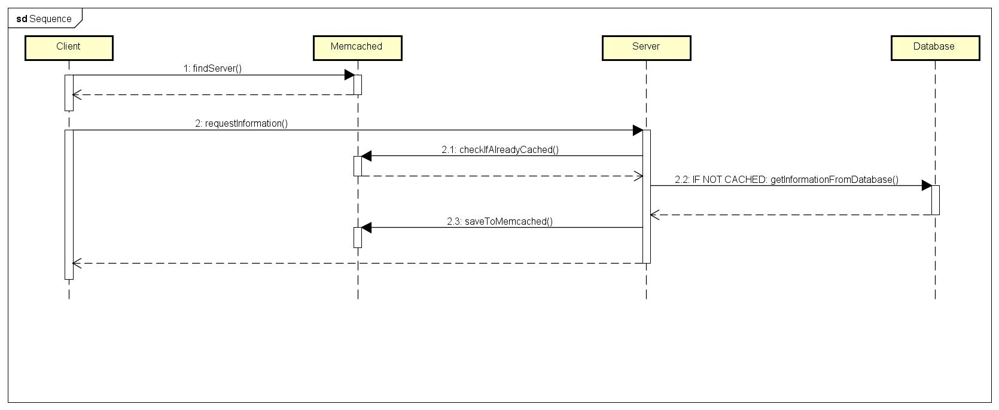

# NAAD
North American Airport Delays

## Description
This project aims to create a distributed system to calculate the arrivals and depatures delays of North American airports between 1987 and 2008.

## Architecture

## Motivation
This project is an universitary study for Distributed Systems subject, ministred by Prof. Tales Tales Bitelo Viegas.

## References
- [Proposal and requisits](https://github.com/selatotal/SistemasDistribuidos/blob/master/Trabalhos/201701/Trabalho2.md)
- [Database](http://stat-computing.org/dataexpo/2009/the-data.html)
- [Database description](http://stat-computing.org/dataexpo/2009/supplemental-data.html)
 
## Authors
- Maikel Maciel Rönnau
- Bruno Accioli
- Lucas Silveira
